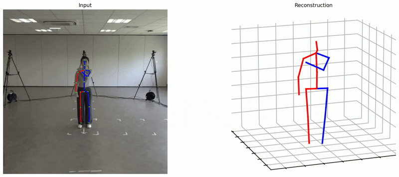
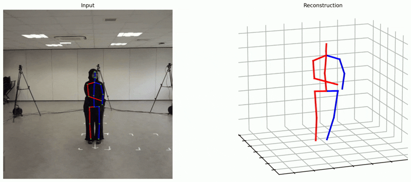
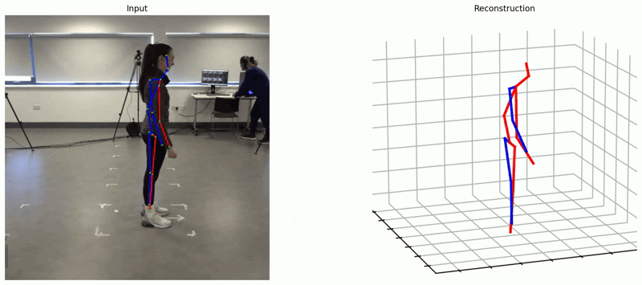
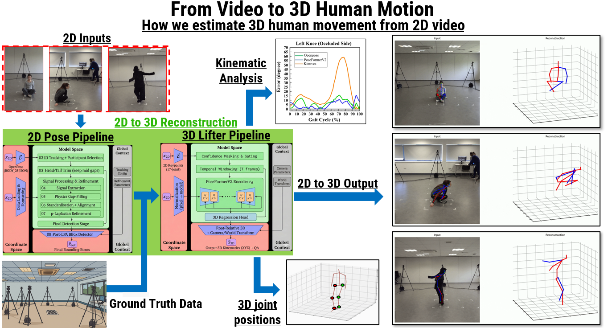

:::::: {.column-screen .custom-banner}
::::: banner-content
:::: banner-text
<h1>Markerless 3D Reconstruction from a Single Camera</h1>

A single-camera pipeline combining 2D keypoints with PoseFormerV2 reconstruction trained on in-lab data

::: banner-gifs
  
:::
::::
:::::
::::::

::: {.column-page .hero-section}
## About the project {#about-the-project}

This project aims to reconstruct 3D human joint positions from a single RGB camera. We use standard video as input, estimate 2D keypoints, and then lift them to 3D using a PoseFormer-based 2D→3D model that is fine-tuned on our own laboratory dataset. Before 2D keypoints are passed to the 3D lifter, they are refined using a non-linear p-Laplacian regulariser (a spatiotemporal, graph-based refinement) to improve temporal consistency and reduce tracking noise.

### Data collection and Dataset

To fine-tune and evaluate the pipeline, we are building a proprietary dataset in a controlled lab setting. Sixty healthy adults perform 70 movement tasks spanning lower- and upper-limb activities (e.g., walking, jumping, overhead reaches), including both slow and fast movements.

Movements are captured using an 8-camera Theia Markerless Technology setup (Sony RX0 II cameras, 120 Hz), with Theia Markerless Technology serving as the 3D reference. The Theia Markerless Technology outputs are processed in Visual3D to quantify kinematics across key body segments, including the ankles, knees, hips, trunk, and upper limbs.
:::

 

{.column-page fig-align="center" width="100%"}


